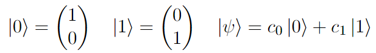
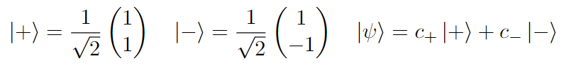
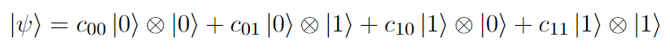
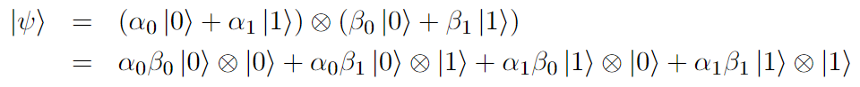
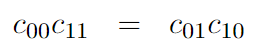

# M08T01 - CBits to QBits

> Enter the Quantum Realm!

## Classical Bits

Classical circuits rely on the binary occurances of `0`s and `1`s, known as ***bits***. 
This means that at the machine level, the computer understands only a series of binary inputs. 
These bits act as switches for voltages required to activate certain gates.

All high-level languages have mechanisms to convert the human-readable program to machine language. 
***Compiler*** languages like C, FORTRAN, and Java use a compiler that takes in the complete source code in a single shot and generates an object code. 
Upon checking for errors, the object code a finally translated to a machine-friendly version.
***Interpreter*** languages like Python and MATLAB translate the source code to machine language line by line. 
This makes debugging easier at the cost of slower total execution times.

Also, all characters have a corresponding mapping to a decimal number in the Unicode table, which can be further represented as a sequence of binary digits. 
For example, the letter `'a'` corresponds to `1100001` in binary notation.

```Python
char = 'a'
val_unicode = ord(char)
val_binary = bin(val_unicode)
print(val_binary[2:])
```

## Quantum Bits

In the quantum regime, computation is performed using quantum states called ***qubits***, aka ***qbits***, an acronym for *quantum bits*. 
Specifically, a qubit is a superposition of the orthonormal basis vectors of a two-level quantum mechanical system. 

### Basis Vectors

The *computational basis* is defined by eigenstates `0` and `1` and their superposition state:



The *standard basis* consists of the eigenstates `+` and `-` and their superposition state:



### Entanglement

Two states are said to be entangled if their combined wave-function cannot be written in terms of their individual separable states. 
It is a highly non-classical behaviour and has multiple applications in quantum information processing.

The generic combined wave-function of two states can be written as:



If the participating states are separable, the combined wave-function can also be written as:



This gives us the condition for separability:



[\[Next\] M08T02 - Circuits and Gates &#8594;](./m08t02-circuits-and-gates.md)
