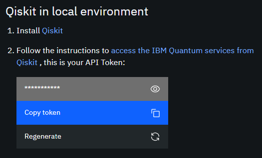

# M08T05 - The Qiskit SDK

[]((https://qiskit.org/))
[](https://qiskit.org/)

> Cloud Computing meets Quantum Computers!

[&#8592; \[Previous\] M08T04 - Algorithms](./m08t04-algorithms.md)

[Corresponding Notebook](./m08t05-the-qiskit-sdk.ipynb)

[*Qiskit*](https://qiskit.org/) is an [open-source framework](http://doi.org/10.5281/zenodo.256211) written in Python which provides access to quantum computing platforms for learning, as well as facilitates research on quantum computation. 
Together with the [IBM Quantum Experience](https://quantum-computing.ibm.com/), it can be used to work with quantum computers at a level of circuits, pulses, and algorithms.

## Installing the SDK

### Setting Up the Python Environment

The Qiskit Software Development Kit (SDK) requires a 64-bit version of Python 3.5 or later and preferably a virtual environment to avoid dependency clashes with other installed packages.

Once you have [set up Python](../m01-getting-started/m01t01-setting-up-python.md), create a new environment for the latest version of Python 3.x.x via the following command:

```bash
conda create --name qcomp python=3
```

Once the environment is created, activate it using:

```bash
conda activate qcomp
```

Update the environment to download the latest packages:

```bash
conda update --all
```

Since `qiskit` is being maintained by the default Python package manager `pip` and does not yet have a `conda` source, we need to update `pip` to its latest version before installing `qiskit`. This can be done by executing:

```bash
pip install --update pip
```

***Note: `pip` does not check for dependency clashes with previously installed packages; hence make sure you create a new environment for `qiskit` with a compatible version of Python.*** 

### Installating Qiskit Packages

Finally, install the latest version of the `qiskit` package along with visualiation functionality using:

```bash
pip install qiskit[visualization]
```

Once all packages and their dependencies are installed, check the version of `qiskit` installed via the following lines in the *interactive mode*:

```python
>> import qiskit
>> qiskit.__version__
```

A one-liner *command line* alternative for the above step is:

```bash
python -c "exec(\"import qiskit\nprint(qiskit.__version__)\")"
```

***Note: The Qiskit SDK comprises of four components (called elements) - Terra, Aer, Ignis, and Aqua - which talk to one another via API calls.***
***When `qiskit.__version__` is called, the installed version of Terra is displayed in the output.***

## Implementing the SDK

### IBM Quantum API Access Token

[*IBM Quantum Experience*](https://quantum-computing.ibm.com/) is a cloud-based platform to provide access to IBM's prototype quantum processors.
It offers a variety of graphical tools to create as well as run quantum algorithms and experiments on their quantum computers. 

Create or Log In to you personal IBM Quantum Experience account from the [official webpage](https://quantum-computing.ibm.com/).

Once logged in, select on the *My Account* option available under the *Profile* icon situated at the top-right corner (or alternatively, visit the [*My Account* page](https://quantum-computing.ibm.com/account) in the same browsing environment). 


Copy the IBM Quantum API access token from the page available under the *Qiskit in local environment* section.



To save the access token in Qiskit configuration file, type the following in the *interactive mode*, replacing `api_access_token` by the copied access token:

```python
>> import qiskit as qk
>> qk.IBMQ.save_account('api_access_token')
```

*The stored access token can be found inside the `$HOME/.qiskit/qiskitrc` file in Linux systems and in `%UserProfile%/.qiskit/qiskitrc` file in Windows systems.*

***Note: Unless mentioned otherwise, we will be using the acronym `qk` for `qiskit`.***

### Executing Locally

Since we are interested in debugging our scripts locally, we need classical simulators to mimic the quantum systems.
Such simulators rely on a `qiskit.QuantumCircuit` object which consists of the collection of qbits and cbits forming the circuit.
For example, a quantum circuit comprising of `num_q` qbits and `num_c` cbits can be written as:

```python
qcirc = qk.QuantumCircuit(num_q, num_c)
```

The `qiskit.Aer` component comes with several backends to sumulate quantum circuits.
These local backends can be listed using:

```python
>> qk.Aer.backends()
```

The required available backend (say the noisy quantum simulator, QASM, named `qasm_simulator`) can be run to simulate the quantum circuit using a *job* instance, which can be executed using:

```python
be = qk.Aer.get_backend('qasm_simulator')
job = qk.execute(qcirc, backend=be)
```

Calling the `result()` method of the `job` instance returns the `Result` object containing the outcome of the execution.

Qiskit's visualization tools can be used to plot the results of the simulated quantum circuit.
A histogram plot of the probabilities of the final state can be obtained as:

```python
>> import qiskit.visualization as qkv
>> qkv.plot_histogram(job.result().get_counts(qcirc))
```

***Note: Unless mentioned otherwise, we will be using the acronym `qkv` for `qiskit.visualization`.***

### Executing in IBM Quantum

IBM Quantum allows access to its prototype quantum computers via cloud interfaces known as *profiders*. 
These contain the backend objects for their quantum systems. 
The list of backends available for a provider (e.g., for the `ibm-q` hub) can be obtained using:

```python
>> be_provider = qk.IBMQ.get_provider('ibm-q')
>> be_provider.backends()
```

Depending upon the requirement, a specific backend available from the list (say `ibmqx2`) can be run to execute a quantum circuit:

```python
>> be = be_provider.get_backend('ibmqx2')
>> job = qk.execute(qcirc, backend=be)
```

Since this job is run in a shared environment, it is queued until the system is available. 
To view the progress of the job, `qiskit.tools` module features a monitor which can be implemented as:

```python
>> qk.tools.job_monitor(job)
```

Upon completion, this displays an output of the form:

```python
Job Status: job has successfully run
```

[The Qiskit SDK notebook](./m08t05-the-qiskit-sdk.ipynb) implements all the above functions stepwise, displaying the results of both the classical simulation and the quantum execution.

*Also, the [qiskit-tutorials repository](https://github.com/Qiskit/qiskit-tutorials) contains an awesome collection of IPython notebooks.*

[\[Next\] M08T06 - Grover's Algorithm &#8594;](./m08t06-algorithm-grover.md)